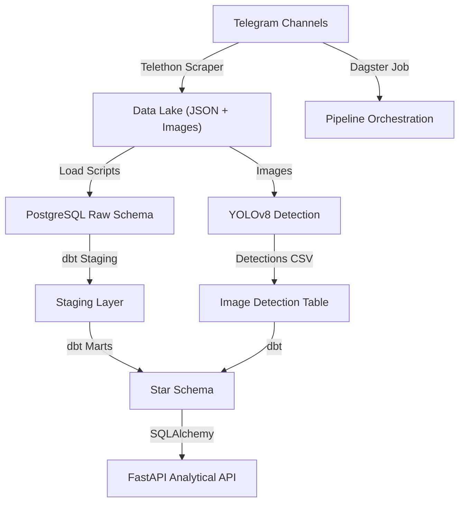

# Medical Telegram Warehouse

An end-to-end data product that ingests public Telegram posts from Ethiopian medical commerce channels, models the content with dbt, enriches images with YOLOv8, and exposes actionable analytics through a FastAPI service orchestrated by Dagster.

## Architecture Overview



## Project Structure

```
medical-telegram-warehouse/
├── api/                    # FastAPI application
├── data/                   # Raw JSON, images, YOLO outputs
├── logs/                   # Scraper and pipeline logs
├── medical_warehouse/      # dbt project (staging + marts)
├── notebooks/              # Exploration & documentation assets
├── scripts/                # Dagster pipeline definition
├── src/                    # Python packages (scraper, loaders, YOLO)
├── tests/                  # Unit tests
├── Dockerfile
├── docker-compose.yml
├── requirements.txt
└── README.md
```

## Quickstart

1. **Create Environment**
   ```bash
   python -m venv .venv
   .venv\Scripts\activate
   pip install -r requirements.txt
   ```

2. **Configure Secrets**
   - Copy `.env.example` to `.env` and fill in Telegram API keys, Postgres credentials, and file paths.

3. **Bootstrap Storage**
   ```bash
   python -m src.scripts.setup_storage
   ```

4. **Run Scraper**
   ```bash
   python -m src.scraper --channels data/config/channels.yml --days 2
   ```

5. **Load Raw JSON to PostgreSQL**
   ```bash
   python -m src.load_to_postgres --schema raw --table telegram_messages
   ```

6. **Run dbt Models**
   ```bash
   cd medical_warehouse
   dbt deps && dbt seed && dbt run && dbt test
   ```

7. **Run YOLO Enrichment**
   ```bash
   python -m src.yolo_detect --image-root data/raw/images --output data/yolo/detections.csv
   python -m src.load_to_postgres --schema raw --table image_detections --source data/yolo/detections.csv
   ```

8. **Launch API**
   ```bash
   uvicorn api.main:app --reload
   ```

9. **Orchestrate with Dagster**
   ```bash
   dagster dev -f scripts/pipeline.py
   ```

## Star Schema Summary

- `dim_channels`: Channel attributes, posting history, engagement aggregates.
- `dim_dates`: Canonical calendar table for daily granularity.
- `fct_messages`: Grain is one Telegram message, includes counts and message metadata.
- `fct_image_detections`: Grain is one YOLO detection joined back to the message fact.

## Analytical Endpoints

| Endpoint | Description |
| --- | --- |
| `GET /api/reports/top-products?limit=10` | Top mentioned product tokens using text search materialized by dbt |
| `GET /api/channels/{channel_name}/activity` | Posting and engagement trend for a single channel |
| `GET /api/search/messages?query=paracetamol&limit=20` | Keyword search over mart tables |
| `GET /api/reports/visual-content` | Aggregations comparing promotional vs product display imagery |

## Dagster Job Graph

Dagster job `medical_telegram_job` chains five ops:
1. `scrape_telegram_data`
2. `load_raw_to_postgres`
3. `run_dbt_transformations`
4. `run_yolo_enrichment`
5. `refresh_analytics_api_cache`

Each op writes log files under `logs/` and exposes observability metadata to Dagster for alerting.

## Testing & Quality

- `pytest` covers text tokenization utilities and YOLO classification logic.
- dbt generic + custom tests guard surrogate keys, relationships, and business rules.
- The FastAPI layer includes Pydantic validation plus SQL parameterization.

## Reporting Guidance

Use `notebooks/pipeline_report.ipynb` to document findings:
- Describe data lake partitioning.
- Embed the star schema mermaid diagram.
- Summarize YOLO insights (promotional vs product display).
- Capture screenshots (dbt docs, FastAPI `/docs`, Dagster UI) for submission.

## Deployment Notes

- `docker-compose.yml` provisions Postgres, MinIO-compatible lake storage, and services.
- GitHub Actions workflow runs lint + pytest on pull requests.
- Keep `.env` untracked and rotate credentials regularly.

Happy shipping! 🚀